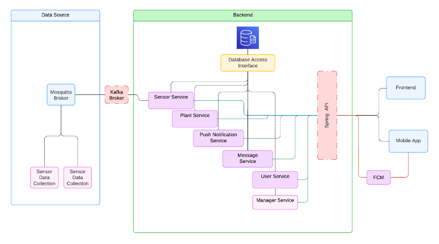

# PlantPatrol

## Project Abstract

A platform to help managing greenhouses for a plant store, on an eco-friendlier way. Final project of [Introduction to Software Engineering](https://www.ua.pt/en/uc/12288) of [Universidade de Aveiro](https://www.ua.pt/)

## Main Features

- Plant inventory management
- Web platform for employees
- Mobile platform for customers
- Chat between employee/customer
- Live and historical data from physical sensors (humidity, temperature, air quality)
- Push notifications for newly available plants

**Full project specification:** [PDF Report](./reports/IES%20Project%20Specification%20Report.pdf)

## Architecture
 

## 🛠️ Tools

#### Backend
- [Spring Boot](https://spring.io/projects/spring-boot)
- [JsonWebToken](https://jwt.io/)
- [Swagger](https://swagger.io/)
- [MongoDB](https://www.mongodb.com/)

#### Web

- [Next.js](https://nextjs.org/)
- [Tailwindcss](https://tailwindcss.com/)

#### Mobile

- [React Native](https://reactnative.dev/)
- [Expo](https://expo.dev/)

#### Event Streaming

- [Kafka](https://kafka.apache.org/)
- [Mosquitto](https://mosquitto.org/)

#### External services

- [Gemini API](https://ai.google.dev/)
- [Google Search API](https://developers.google.com/custom-search/v1/overview)
- [Firebase Cloud Messaging](https://firebase.google.com/docs/cloud-messaging)

#### DevOps

- [Docker](https://www.docker.com/)
- [Github Actions](https://github.com/features/actions)

## Running

- Copy the .env.example to .env
- Get your credentials of the gemini API and google search API and put them in there (optional).

```console
$ docker compose up -d
```

### Running the mobile app

```console
$ cd mobile
$ npm install
$ npm run start
```

### Running the virtual sensors

```console
$ cd raspberrypi/virtual-data
$ poetry install
$ poetry run virtual
```

## Grade

- 19.6 / 20.0
